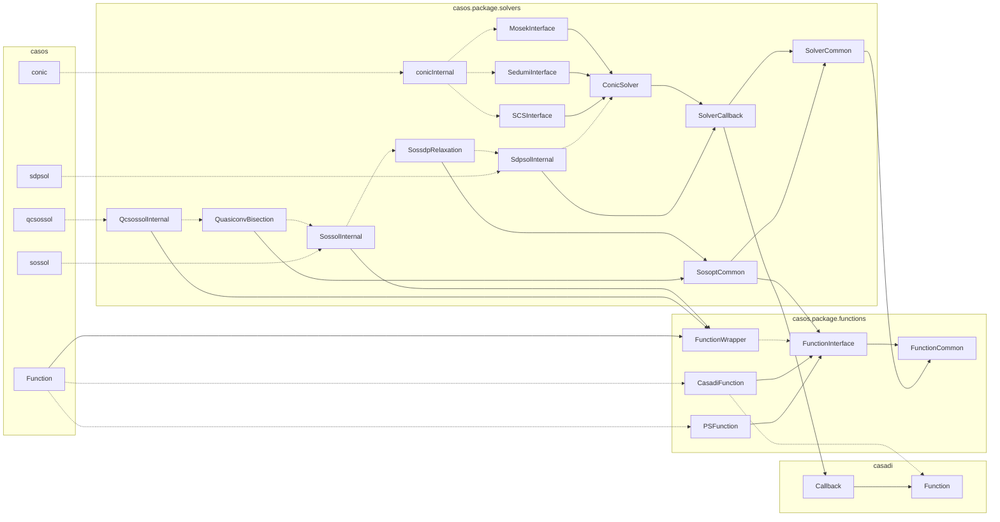

# Internal class diagram

```mermaid
flowchart LR
  subgraph casadi
    casadi.Callback[Callback] --> casadi.Function[Function]
  end
  subgraph casos
    casos.Function[Function]
    casos.conic[conic]
    casos.sdpsol[sdpsol]
    casos.sossol[sossol]
    casos.qcsossol[qcsossol]
  end
  subgraph casos.package.functions
    FunctionInterface --> FunctionCommon
    FunctionWrapper -.-> FunctionInterface
    CasadiFunction --> FunctionInterface
    PSFunction --> FunctionInterface
  end
  subgraph casos.package.solvers
    ConicSolver --> SolverCallback
    SolverCallback --> SolverCommon
    MosekInterface --> ConicSolver
    SedumiInterface --> ConicSolver
    SCSInterface --> ConicSolver
    SdpsolInternal --> SolverCallback
    SdpsolInternal -.-> ConicSolver
    conicInternal -.-> MosekInterface
    conicInternal -.-> SedumiInterface
    conicInternal -.-> SCSInterface
    SosoptCommon --> SolverCommon
    SossolInternal --> FunctionWrapper
    SossolInternal -.-> SossdpRelaxation
    SossdpRelaxation --> SosoptCommon
    SossdpRelaxation -.-> SdpsolInternal
    QcsossolInternal --> FunctionWrapper
    QcsossolInternal -.-> QuasiconvBisection
    QuasiconvBisection --> SosoptCommon
    QuasiconvBisection -.-> SossolInternal
  end
  casos.Function --> FunctionWrapper
  casos.Function -.-> CasadiFunction
  casos.Function -.-> PSFunction
  CasadiFunction -.-> casadi.Function
  SolverCallback --> casadi.Callback
  SolverCommon --> FunctionCommon
  SosoptCommon --> FunctionInterface
  casos.conic -.-> conicInternal
  casos.sdpsol -.-> SdpsolInternal
  casos.sossol -.-> SossolInternal
  casos.qcsossol -.-> QcsossolInternal
```
