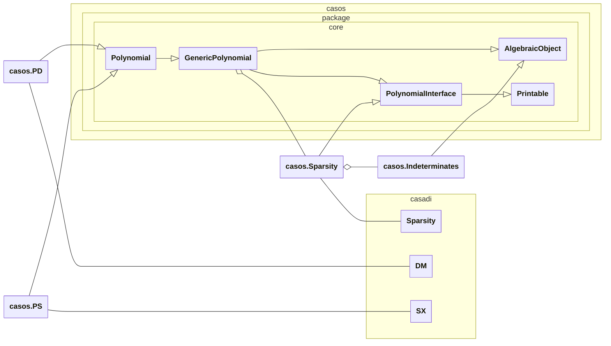
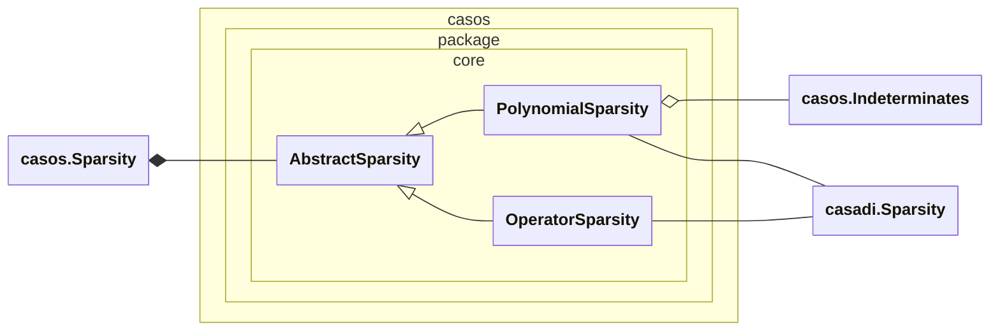
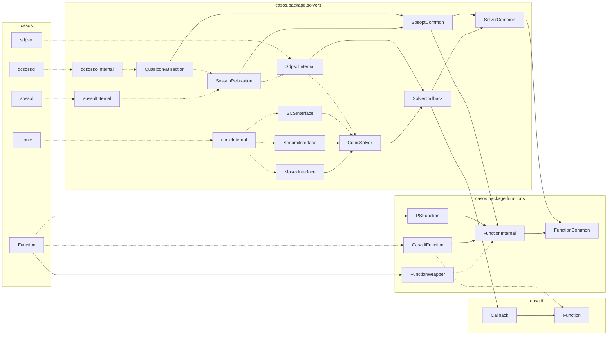

# Internal class diagram

## Polynomial types

```mermaid
---
config:
  class:
    hideEmptyMembersBox: true
---
classDiagram
  direction LR
  namespace casadi {
    class casadi.DM["DM"]
    class casadi.SX["SX"]
    class casadi.Sparsity["Sparsity"]
  }
  namespace casos.package.core {
    class Polynomial
    class GenericPolynomial
    class AlgebraicObject
    class PolynomialInterface
    class Printable
  }
  Polynomial --|> GenericPolynomial
  GenericPolynomial --|> AlgebraicObject
  GenericPolynomial --|> PolynomialInterface
  PolynomialInterface --|> Printable
  %% general
  class casos.PD
  class casos.PS
  class casos.Sparsity
  class casos.Indeterminates
  casos.Sparsity o-- casos.Indeterminates
  casos.PD --|> Polynomial
  casos.PD -- casadi.DM
  casos.PS --|> Polynomial
  casos.PS -- casadi.SX
  casos.Sparsity --|> PolynomialInterface
  casos.Sparsity -- casadi.Sparsity
  casos.Indeterminates --|> AlgebraicObject
  GenericPolynomial o-- casos.Sparsity
```

## Sparsity types

```mermaid
---
config:
  class:
    hideEmptyMembersBox: true
---
classDiagram
  direction LR
  namespace casos.package.core {
    class AbstractSparsity
    class PolynomialSparsity
    class OperatorSparsity
  }
  AbstractSparsity <|-- PolynomialSparsity
  PolynomialSparsity o-- casos.Indeterminates
  PolynomialSparsity -- casadi.Sparsity
  AbstractSparsity <|-- OperatorSparsity
  OperatorSparsity -- casadi.Sparsity
  casos.Sparsity *-- AbstractSparsity
```

## Functions & Solvers

```mermaid
flowchart LR
  subgraph casadi
    casadi.Callback[Callback] --> casadi.Function[Function]
  end
  subgraph casos
    casos.Function[Function]
    casos.conic[conic]
    casos.sdpsol[sdpsol]
    casos.sossol[sossol]
    casos.qcsossol[qcsossol]
  end
  subgraph casos.package.functions
    FunctionInternal --> FunctionCommon
    FunctionWrapper -.-> FunctionInternal
    CasadiFunction --> FunctionInternal
    PSFunction --> FunctionInternal
  end
  subgraph casos.package.solvers
    ConicSolver --> SolverCallback
    SolverCallback --> SolverCommon
    MosekInterface --> ConicSolver
    SedumiInterface --> ConicSolver
    SCSInterface --> ConicSolver
    SdpsolInternal --> SolverCallback
    SdpsolInternal -.-> ConicSolver
    conicInternal -.-> MosekInterface
    conicInternal -.-> SedumiInterface
    conicInternal -.-> SCSInterface
    SosoptCommon --> SolverCommon
    sossolInternal -.-> SossdpRelaxation
    SossdpRelaxation --> SosoptCommon
    SossdpRelaxation -.-> SdpsolInternal
    qcsossolInternal -.-> QuasiconvBisection
    QuasiconvBisection --> SosoptCommon
    QuasiconvBisection -.-> SossdpRelaxation
  end
  casos.Function --> FunctionWrapper
  casos.Function -.-> CasadiFunction
  casos.Function -.-> PSFunction
  CasadiFunction -.-> casadi.Function
  SolverCallback --> casadi.Callback
  SolverCommon --> FunctionCommon
  SosoptCommon --> FunctionInternal
  casos.conic -.-> conicInternal
  casos.sdpsol -.-> SdpsolInternal
  casos.sossol -.-> sossolInternal
  casos.qcsossol -.-> qcsossolInternal
```
