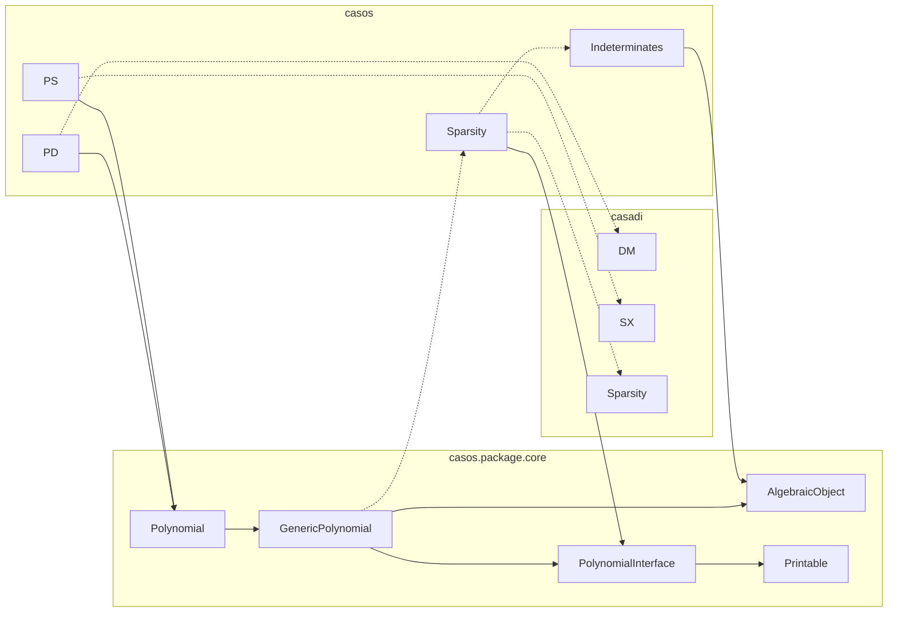
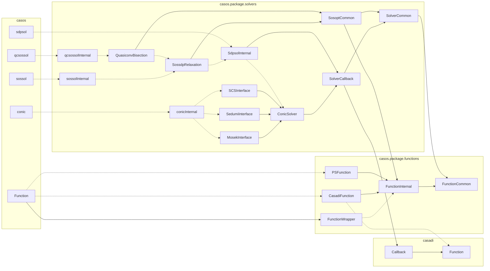

# Internal class diagram

## Polynomial types

```mermaid
flowchart LR
  subgraph casadi
    casadi.DM[DM]
    casadi.SX[SX]
    casadi.Sparsity[Sparsity]
  end
  subgraph casos
    casos.PD[PD]
    casos.PS[PS]
    casos.Sparsity[Sparsity] -.-> casos.Indeterminates[Indeterminates]
  end
  subgraph casos.package.core
    Polynomial --> GenericPolynomial
    GenericPolynomial --> AlgebraicObject
    GenericPolynomial --> PolynomialInterface
    PolynomialInterface --> Printable
  end
  casos.PD --> Polynomial
  casos.PD -.-> casadi.DM
  casos.PS --> Polynomial
  casos.PS -.-> casadi.SX
  casos.Sparsity --> PolynomialInterface
  casos.Sparsity -.-> casadi.Sparsity
  casos.Indeterminates --> AlgebraicObject
  GenericPolynomial -.-> casos.Sparsity
```

## Functions & Solvers

```mermaid
flowchart LR
  subgraph casadi
    casadi.Callback[Callback] --> casadi.Function[Function]
  end
  subgraph casos
    casos.Function[Function]
    casos.conic[conic]
    casos.sdpsol[sdpsol]
    casos.sossol[sossol]
    casos.qcsossol[qcsossol]
  end
  subgraph casos.package.functions
    FunctionInternal --> FunctionCommon
    FunctionWrapper -.-> FunctionInternal
    CasadiFunction --> FunctionInternal
    PSFunction --> FunctionInternal
  end
  subgraph casos.package.solvers
    ConicSolver --> SolverCallback
    SolverCallback --> SolverCommon
    MosekInterface --> ConicSolver
    SedumiInterface --> ConicSolver
    SCSInterface --> ConicSolver
    SdpsolInternal --> SolverCallback
    SdpsolInternal -.-> ConicSolver
    conicInternal -.-> MosekInterface
    conicInternal -.-> SedumiInterface
    conicInternal -.-> SCSInterface
    SosoptCommon --> SolverCommon
    sossolInternal -.-> SossdpRelaxation
    SossdpRelaxation --> SosoptCommon
    SossdpRelaxation -.-> SdpsolInternal
    qcsossolInternal -.-> QuasiconvBisection
    QuasiconvBisection --> SosoptCommon
    QuasiconvBisection -.-> SossdpRelaxation
  end
  casos.Function --> FunctionWrapper
  casos.Function -.-> CasadiFunction
  casos.Function -.-> PSFunction
  CasadiFunction -.-> casadi.Function
  SolverCallback --> casadi.Callback
  SolverCommon --> FunctionCommon
  SosoptCommon --> FunctionInternal
  casos.conic -.-> conicInternal
  casos.sdpsol -.-> SdpsolInternal
  casos.sossol -.-> sossolInternal
  casos.qcsossol -.-> qcsossolInternal
```
